<picture>
  <source media="(prefers-color-scheme: dark)" srcset="assets/header-dark.svg">
  <source media="(prefers-color-scheme: light)" srcset="assets/header-light.svg">
  
</picture>

Python backend developer from Slovakia, now studying Informatics at MFF UK (Charles University) in Prague.

I like the quiet parts of a system — pipelines, schemas, the services that have to not-break at 3am.

<picture>
  <source media="(prefers-color-scheme: dark)" srcset="assets/stack-dark.svg">
  <source media="(prefers-color-scheme: light)" srcset="assets/stack-light.svg">
  
</picture>

### Where I've worked

<b>FUERGY</b> — backend developer, energy-tech (Žilina)

 

Backend for a large-scale energy-management platform.

- Python services over PostgreSQL/TimescaleDB with SQLAlchemy.
- End-to-end data pipelines in Apache Airflow, feeding core business functions.
- Testing and deployment through Git, Docker, and GitLab CI/CD.

<b>Slovenské elektrárne</b> — full-stack developer (Bratislava)

 

Built and deployed a full-stack app solo — picked the stack, wrote it, took it to production.

- Python, Flask, AWS EC2 on the back; JavaScript, HTML, CSS on the front.
- Owned it from problem definition to finished, deployed product.

<b>CS50x</b> — Harvard via edX

 

Introduction to Computer Science — [certificate](https://certificates.cs50.io/35ff9056-2ded).

### Currently

First-year Informatics student at MFF UK, Prague — widening out from backend and data-pipeline work into CS fundamentals. Reading *Designing Data-Intensive Applications*, poking at Go on the side.

📫 maruscak.matus@gmail.com · [LinkedIn](https://www.linkedin.com/in/matúš-maruščák/)
